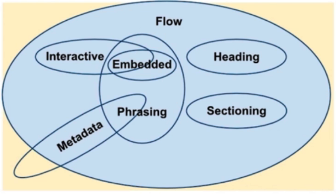

# HTML基础强化

## 常见元素和理解

## 版本

- HMTL4/4.01 (SGML)
- XHMTL (XML)
- HTML5

## 元素分类

- 按默认样式分
  - 块级 block
  - 行内 inline
    : 不一定有固定形状
  - inline-block
- 按内容分
  - 
  - [more](https://html.spec.whatwg.org/multipage/dom.html#kinds-of-content)

## 嵌套关系

- 块级元素可以包含行内元素
- 块级元素不一定能包含块级元素
- 行内元素一般不能包含块级元素
  - 为什么a>div是合法的? a is transparent.

    ```html
    <p><a><div></div></a></p>
    计算嵌套关系时为:
    <p><div></div></p>
    ```

## 默认样式和reset

- CSS Reset
  - [Meyerweb](http://meyerweb.com/eric/tools/css/reset/)

    ```css
    /* http://meyerweb.com/eric/tools/css/reset/
    v2.0 | 20110126
    License: none (public domain)
    */
    html, body, div, span, applet, object, iframe,
    h1, h2, h3, h4, h5, h6, p, blockquote, pre,
    a, abbr, acronym, address, big, cite, code,
    del, dfn, em, img, ins, kbd, q, s, samp,
    small, strike, strong, sub, sup, tt, var,
    b, u, i, center,
    dl, dt, dd, ol, ul, li,
    fieldset, form, label, legend,
    table, caption, tbody, tfoot, thead, tr, th, td,
    article, aside, canvas, details, embed,
    figure, figcaption, footer, header, hgroup,
    menu, nav, output, ruby, section, summary,
    time, mark, audio, video {
        margin: 0;
        padding: 0;
        border: 0;
        font-size: 100%;
        font: inherit;
        vertical-align: baseline;
    }
    /* HTML5 display-role reset for older browsers */
    article, aside, details, figcaption, figure,
    footer, header, hgroup, menu, nav, section {
        display: block;
    }
    body {
        line-height: 1;
    }
    ol, ul {
        list-style: none;
    }
    blockquote, q {
        quotes: none;
    }
    blockquote:before, blockquote:after,
    q:before, q:after {
        content: '';
        content: none;
    }
    table {
        border-collapse: collapse;
        border-spacing: 0;
    }
    ```

  - YUI
  
    ```css
    /*
    YUI 3.18.1 (build f7e7bcb)
    Copyright 2014 Yahoo! Inc. All rights reserved.
    Licensed under the BSD License.
    http://yuilibrary.com/license/
    */

    html{color:#000;background:#FFF}body,div,dl,dt,dd,ul,ol,li,h1,h2,h3,h4,h5,h6,pre,code,form,fieldset,legend,input,textarea,p,blockquote,th,td{margin:0;padding:0}table{border-collapse:collapse;border-spacing:0}fieldset,img{border:0}address,caption,cite,code,dfn,em,strong,th,var{font-style:normal;font-weight:normal}ol,ul{list-style:none}caption,th{text-align:left}h1,h2,h3,h4,h5,h6{font-size:100%;font-weight:normal}q:before,q:after{content:''}abbr,acronym{border:0;font-variant:normal}sup{vertical-align:text-top}sub{vertical-align:text-bottom}input,textarea,select{font-family:inherit;font-size:inherit;font-weight:inherit;*font-size:100%}legend{color:#000}#yui3-css-stamp.cssreset{display:none}
    ```

  - Simple way
  
    ```css
    * {
        margin: 0;
        padding: 0;
    }
    ```

  - Normalize.css
  
## 面试真题

1. doctype的意义是什么？
   - 让浏览器以标准模式渲染
   - 让浏览器知道元素的合法性

2. HTML XHTML HTML5的关系
   - HTML属于SGML
   - XHTML属于XML，是HTML进行XML严格化的结果
   - HTML5不属于SGML或XML，比XHTML宽松

3. HTML5有什么变化
   - 新的语义化元素
   - 表单增强
   - 新的API（离线，音视频，图形，实时通信，本地储存，设备能力）
   - 分类和嵌套变更

4. em和i有什么区别
   - em是语义化的标签，表强调
   - i是纯样式的标签，表斜体
   - HTML5中i不推荐使用，一般用作图标

5. 语义化的意义是什么？
   - 开发者容易理解
   - 机器容易理解结构（搜索，度屏软件）
   - 有助于SEO
   - semantic microdata

6. 哪些元素可以自闭合
   - 表单元素 input
   - 图片 img
   - br hr
   - meta link

7. HTML和DOM的关系
   - HTML是“死”的
   - DOM是由HTML解析而来的，是“活”的
   - JS可以维护DOM

8. property和attribute的区别
   - attribute是“死”的
   - property是“活”的

9. form的作用有哪些
   - 直接提交表单
   - 使用submit/reset按钮
   - 便于浏览器保存表单
   - 第三方库可以整体提取值
   - 第三方库可以进行表单验证
