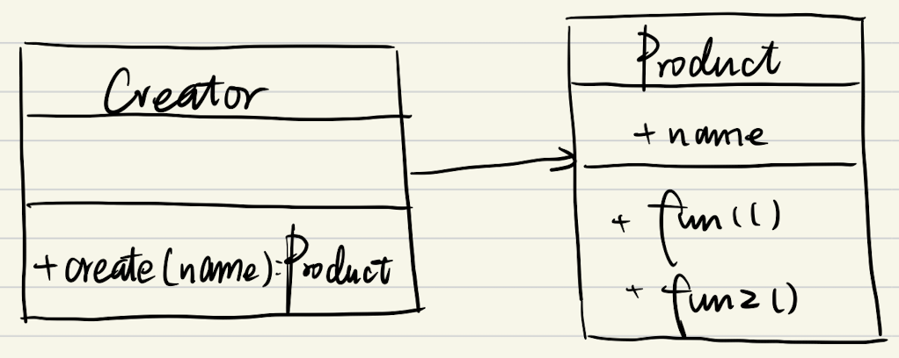

# JS设计模式(2) - 工厂模式

## 1. 介绍

- 将new操作单独封装
- 遇到new时，就要考虑是否该使用工厂模式

- UML类图
  - 
  - 代码

    ```js
    class Product {
      constructor(name) {
        this.name = name
      }
      fun1() {
        console.log('fun1')
      }
      fun2() {
        console.log('fun2')
      }
    }
    class Creator {
      create(name) {
        return new Product(name)
      }
    }

    let creator = new Creator()
    let p = creator.create('wyh')
    ```

## 2. 场景

- JQuery
  - $('div')是工厂
    - 绑定在window.$
    - 代码
  
    ```js
    class jQuery {
      constructor(selector) {
        let slice = Array.prototype.slice
        let dom = slice.call(document.querySelectorAll(selector))
        let len = dom ? dom.length : 0
        for (let i = 0; i < len; i++) {
          this[i] = dom[i]
        }
        this.length = len
        this.selector = selector || ''
      }
      append(node) {}
      addClass(name) {}
      html(data) {}
      // ... 还有很多API
    }
    window.$ = function (selector) {
      return new jQuery(selector)
    }
    ```

  - 优势
    - 书写简单，有利于jQuery的链式操作
    - 如果jQuery名字变化，也可以轻松应对

- React.createElement

  1. React.createElement

    ```js
    var profile = <div>
      
      <h3>{[user.firstName, user.lastName].join(' ')}</h3>
    </div>;
    ```

  2. 上面是语法糖，转化成下面

    ```js
    var profile = React.createElement("div", null,
      React.createElement("img", {src: "avatar.png", className: "profile"}), 
      React.createElement("h3", null, [user.firstName, user.lastName].join(' '))
    );
    ```

  3. 创建虚拟DOM，工厂模式

    ```js
    class Vnode(tag, attrs, children) { }
    React.createElement = function (tag, attrs, children) {
      return new Vnode(tag, attrs, children)
    }
    ```

- Vue异步组件

    ```js
    Vue.component('async-example', function (resolve, reject) {
      setTimeout(function () {
        resolve({
          template: '<div>I am async!</div>'
        })
      }, 1000)
    })
    ```

## 3. 设计原则

- 构造函数和创建者分离
- 符合开放封闭原则
