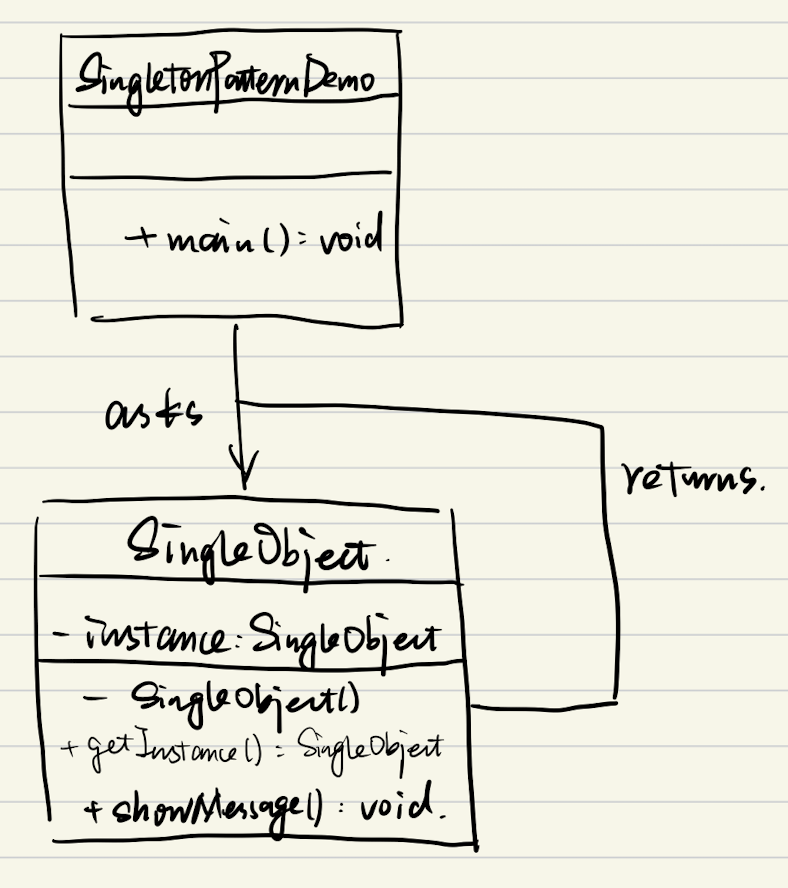

# JS设计模式(3) - 单例模式

## 1. 介绍

- 一个类有且仅有一个实例。该类负责创建自己的对象，同时确保只有一个对象被创建

## 2. Java中的单例模式

- UML类图
  - 
  - 单例模式需要用到Java的特性（private），而ES6没有（typescript除外）
  - 代码 : 核心思想就是没有实例就创建，有的话就直接返回

  ```java
  public class SingleObject {  
    // 私有化构造函数
    private SingleObject(){}
    // 唯一被new出来的对象
    private SingleObject instance = null;
    // 获取对象的唯一接口
    public SingleObject getInstance() {  
    if (instance == null) {  
      // 只 new 一次
      instance = new SingleObject();  
    }  
    return instance;  
    }
    // 对象方法
    public void print(name) {
      System.out.println(name);
    }
  }

  public class SingletonPatternDemo {
    public static void main(String[] args) {
      // 获取唯一可用的对象
      SingleObject object = SingleObject.getInstance();
      object.print("wyh");
    }
  }
  ```

## 3. JS使用单例模式

- 利用闭包，但无法完全控制（可以通过模块化的方法完全控制 *TODO*）
  - 代码

  ```js
  class SingleObject {
    print() {
      console.log('wyh')
    }
  }
  // 设置静态方法
  SingleObject.getInstance = (function() {
    let instance
    return function() {
      if (!instance) {
        instance = new SingleObject();
      }
      return instance
    }
  })()

  let obj1 = SingleObject.getInstance()
  let obj2 = SingleObject.getInstance()
  obj1.print()
  obj2.print()
  // 无法完全控制，仍然可以：
  let obj3 = new SingleObject()
  ```

## 4. 场景

- jQuery只有一个$
- 模拟登录框
- 购物车
- vuex和redux中的store

## 5. 设计原则

- 符合单一职责原则，只实例化唯一的对象
- 没法具体开放封闭原则，但是绝对不违反开放封闭原则
