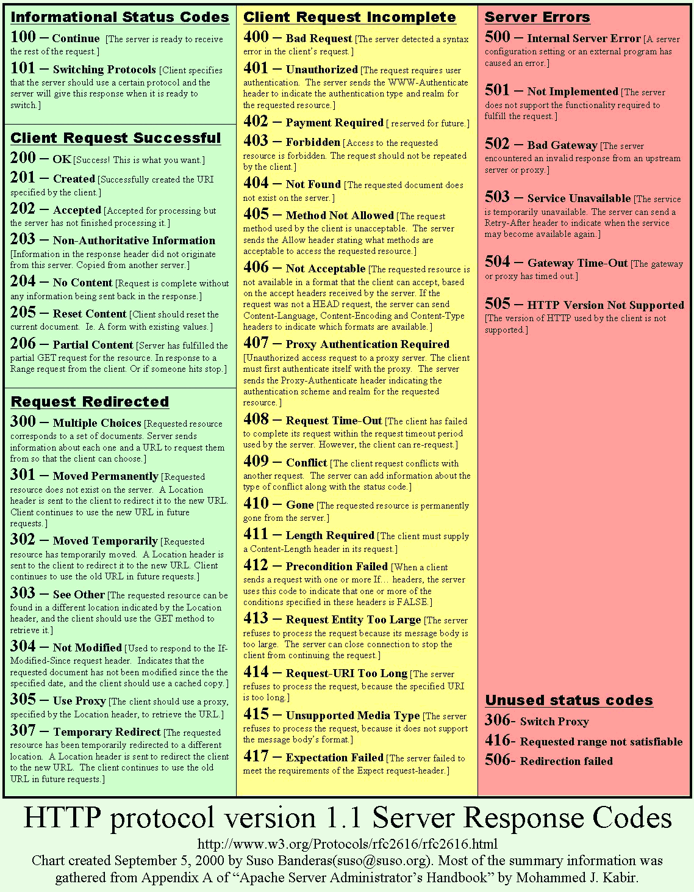

# HTTP协议

## 1. HTTP协议的主要特点

- 简单快速
- 灵活
  - HTTP允许传输任意类型的数据对象。正在传输的类型由Content-Type（Content-Type是HTTP包中用来表示内容类型的标识）加以标记。
- 无连接
  - 无连接的含义是限制每次连接只处理一个请求。服务器处理完客户的请求，并收到客户的应答后，即断开连接。采用这种方式可以节省传输时间。
  - Keep-Alive功能使客户端到服务器端的连接持续有效，避免反复重建连接。
- 无状态
  - HTTP协议对于事务处理没有记忆能力，服务器不知道客户端是什么状态。
  - 使用Cookie，Session解决

## 2. HTTP报文的组成部分

### 2.1. 请求报文

- 请求行
  > GET /index.html HTTP/1.1
  - 请求方法
    - GET-获取资源、POST-传输资源、HEAD-获取报文首部、PUT-更新资源、DELETE-删除资源
    - GET : 不适合传送私密数据，最多只能识别1024个字符，所以如果需要传送大量数据的时候，也不适合使用GET方式
    - POST : POST方法将请求参数封装在HTTP请求体中，以名称/值的形式出现，可以传输大量数据，这样POST方式对传送的数据大小没有限制，而且也不会显示在URL中
  - URL
  - 协议版本
    - 现在主流是HTTP 1.1
    - HTTP 1.1新特性
      - **Keep-Alive**模式，Keep-Alive功能使客户端到服务器端的连接持续有效，当出现对服务器的后继请求时，Keep-Alive功能避免了建立或者重新建立连接。
      - **chunked**编码传输，是HTTP中的一种数据传输机制，它允许HTTP由网页服务器发送给客户端应用的**数据可以分成多个部分**。
        - 通常情况下，HTTP应答消息中发送的数据是整个发送的，Content-Length消息头字段表示数据的长度。数据的长度很重要，因为客户端需要知道哪里是应答消息的结束，以及后续应答消息的开始。然而，使用分块传输编码，数据分解成一系列数据块，并以一个或多个块发送，这样服务器可以发送数据而**不需要预先知道发送内容的总大小**。
      - **管线化 pipelining**，是指**将多个HTTP请求整批发送**，在发送过程中不用等待对方响应。
        - 持久连接时 : 请求1 -> 响应1 -> 请求2 -> 响应2 -> 请求3 -> 响应3
        - 引入管线化 : 请求1 -> 请求2 -> 请求3 -> 响应1 -> 响应2 -> 响应3
        - 管线化机制需通过持久连接完成
        - 只有GET和HEAD请求可以进行管线化
        - 管线化不影响响应的顺序
        - 要求服务器端支持管线化
- 请求头
  - 请求头部由关键字/值对组成，每行一对，关键字和值用英文冒号“:”分隔
  - 请求头部通知服务器有关于客户端请求的信息，例如：
    - User-Agent : 发出请求的用户信息，比如浏览器类型
    - Accept : 客户端能够接收的内容类型
    - Host : 请求的服务器的域名和端口号
    - Connection : 表示是否需要持久连接。（HTTP 1.1默认进行持久连接）
    - Content-type : 表示具体请求中的媒体类型信息。MediaType，即Internet Media Type，互联网媒体类型，也叫做MIME类型。
      - text/html:HTML格式; text/plain:纯文本格式; text/xml:XML格式;
      - image/gif:gif图片格式; image/jpeg:jpg图片格式; image/png:png图片格式
      - application/
        - application/xhtml+xml : XHTML格式
        - application/xml : XML数据格式
        - application/atom+xml : Atom XML聚合格式
        - application/json : JSON数据格式
        - application/pdf : pdf格式
        - application/msword : Word文档格式
        - application/octet-stream : 二进制流数据（如常见的文件下载）
      - application/x-www-form-urlencoded : **在发送到服务器之前应该如何对表单数据进行编码**, \<form encType="">中**默认**的encType，form表单数据被编码为key/value格式发送到服务器（表单默认的提交数据的格式）
      - multipart/form-data : 需要在表单中进行文件上传时

- 空行
- 请求体
  - 请求数据不在GET方法中使用，而是在POST方法中使用
  - 需要设置Content-length和Content-type

### 2.2. 响应报文

- 状态行
  - 协议版本、状态码及其描述组成，例如HTTP/1.1 200 OK
- 响应头
  - Content-Encoding : 文档的编码(Encode)方法
  - Content-Length
  - Content-type
  - Last-Modified : 请求资源的最后修改时间
  - Cache-Control : 指定请求和响应遵循的缓存机制
  - Date : 表示消息发送的时间
- 空行
- 响应体

## 3. HTTP状态码

- 1xx : 指示信息
- 2xx : 成功
- 3xx : 重定向 - 要完成请求必须进行更进一步的操作
- 4xx : 客户端错误 - 请求有语法错误或请求无法实现
- 5xx : 服务器错误 - 服务器未能实现合法的请求

- 在*详解Ajax*中也有相关内容
- 