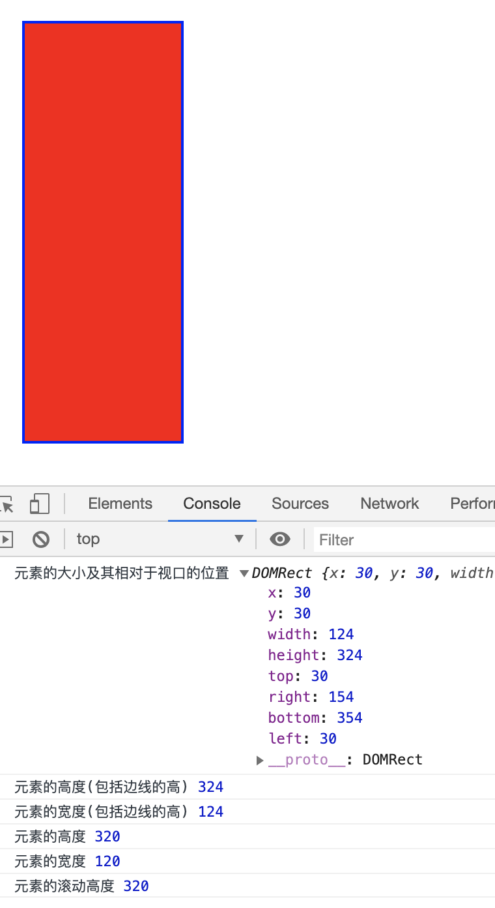

```js
    console.log('元素的大小及其相对于视口的位置', article.getBoundingClientRect())
    console.log('元素的高度(包括边线的高)', article.offsetHeight)
    console.log('元素的宽度(包括边线的高)', article.offsetWidth)
    console.log('元素的高度', article.clientHeight)
    console.log('元素的宽度', article.clientWidth)
```

