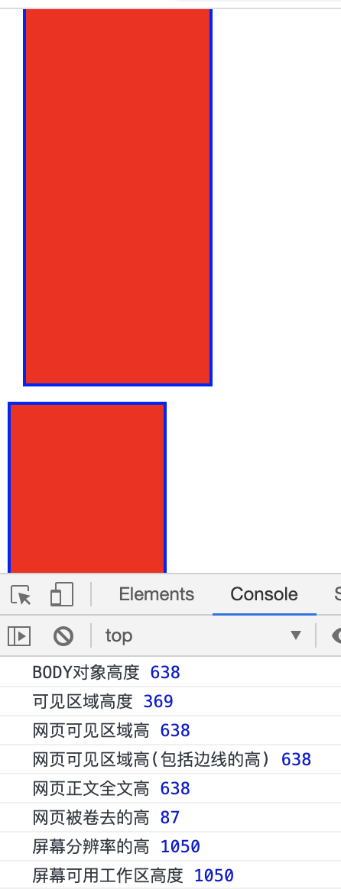

|属性|含义|
|-|-|
|document.body.clientWidth(Height)|BODY对象宽度(高度)，以下同理|
|document.documentElement.clientHeight|可见区域高度|
|document.body.clientHeight|网页可见区域高|
|document.body.offsetHeight|网页可见区域高(包括边线的高)|
|document.body.scrollHeight|网页正文全文高|
|document.body.scrollTop|网页被卷去的高|
|window.screenTop|网页正文部分上|
|window.screen.height|屏幕分辨率的高|
|window.screen.availHeight|屏幕可用工作区高度|

- **Document.documentElement** 是一个会返回文档对象（document）的根元素的只读属性（如HTML文档的 <html> 元素）。

- 示例

