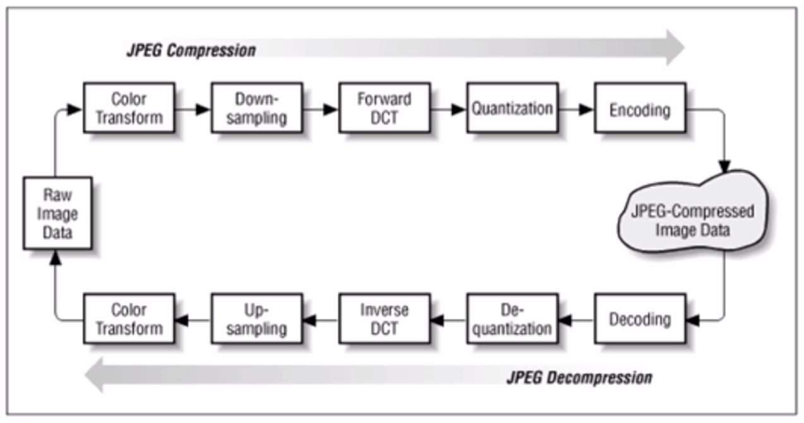

# Web前端性能优化(2) - 图片相关的优化

## JPEF压缩和解压缩

- 有损压缩 一张JPG图片的解析过程


## png8/png24/png32之间的区别

- png8 : 256色 + ==支持透明==
- png24 : 2^24色 + ==不支持透明==
- png32 : 2^24色 + ==支持透明==
	- 相较于png24，多8bit表达透明度
- 里面有个调色板，颜色建立索引

## 不同格式图片常用的业务场景

- 每种图片格式都有自己的特点，针对不同的业务场景选择不同的图片格式很重要
	- jpg有损压缩，==压缩率高==，==不支持透明==
		- **大部分不需要透明图片的业务场景**
	- png==支持透明==，浏览器兼容好
		- **大部分需要透明图片的业务场景**
	- webp==压缩程度更好==，在ios webview有兼容性问题
		- **安卓全部**
	- svg矢量图，代码内嵌，==相对较小==
		- 图片样式**相对简单的场景**
		- iconfont

## 图片压缩几种方法

- 在线压缩
	- https://tinypng.com/
- CSS雪碧图
	- 把你的网站上用到的一些图片整合到一张单独的图片
	- **优点** : 减少你的网站的HTTP请求数量
	- **缺点** : 可能整合的文件特别大，如果该文件未加载，导致整个页面的图片无法显示。需要酌情优化。
	- spritecow.com
		- 用于生成雪碧图
		- 得到不同部分的background-position

- inline image
	- 将图片的内容内嵌到html当中
		- 减少你的网站的HTTP请求数量
	- 示例 : ```<imgsrc="data:image/png;base64,iVAGRw0KGDCFGNSUhEUgACBBQAVGADCAIATYJ7ljmRGGAAGElEVQQIW2P4DwcMDAxAfBvMAhEQMYgcACEHG8ELxtbPACCCTElFTEVBQmGA" />```
	- 比如设置一个标准，小于8kb，在构建工具中设置将其编程inline image

- 使用矢量图
	- 使用SVG进行矢量图的绘制
	- 使用iconfont解决icon问题

- 在安卓下使用webp