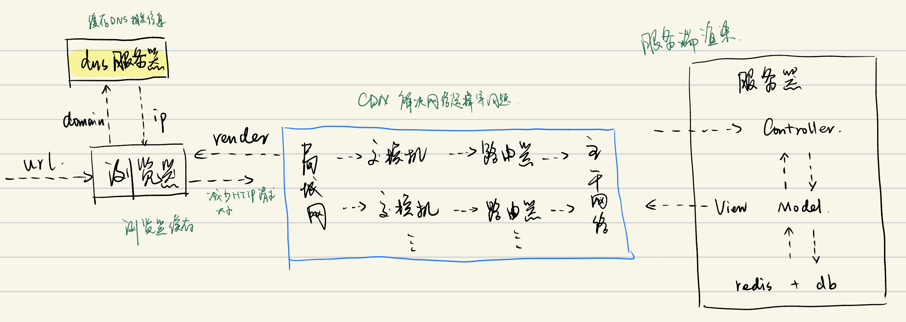
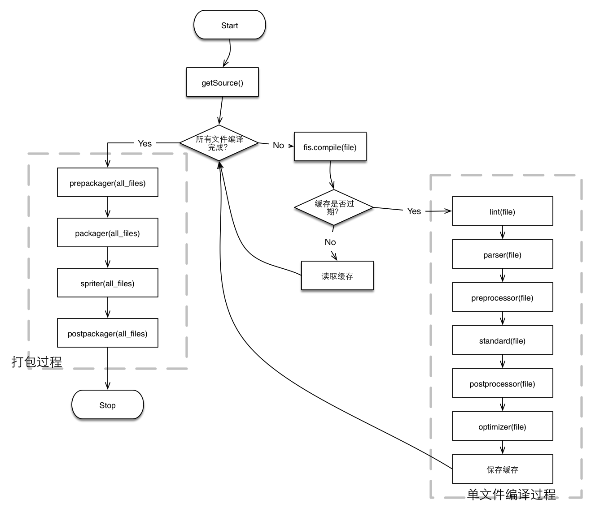

# Web前端性能优化(1) - 引言 & 资源压缩与合并

## 0. 写在前面

- 请求的过程
  1. DNS解析
  2. TCP连接
  3. 发送HTTP请求
  4. 服务器处理请求并返回HTTP报文
  5. 浏览器解析渲染页面
  6. 连接结束
  - 

- 其中可能有的优化方向
  1. DNS是否可以通过缓存减少DNS查询时间？
  2. 网络请求的过程走最近网络环境？
  3. 相同的静态资源是否可以缓存？
  4. 能否减少http请求大小？
  5. 减少http请求
  6. 服务端渲染

## 1. 资源的合并与压缩

- 减少http请求数量
- 减少请求资源的大小

- HTML压缩
  - 压缩在文本文件中有意义，但在**HTML中不显示的字符**，包括空格，制表符，换行符，注释等。
  - 如何进行？
    - NodeJS提供了html-minifier工具
    - 后端模板引擎渲染压缩
    - 一些打包工具

- CSS压缩
  - 无效代码删除，CSS寓意合并
  - 如何进行？
    - html-minifier
    - clean-css

- JS压缩与混乱
  - 无效字符的删除，剔除注释
  - 代码语义的缩减和优化
  - 代码保护
  - 如何进行JS压缩和混乱？
    - html-minifier
    - uglifyjs2

- 文件合并
  - 为什么进行文件合并？
    - 文件与文件之间有**插入的上行请求**，增加了N-1个网络延时，合并后可以降低延迟
  - 缺点
    - 首屏渲染问题
    - 缓存失效问题
      - 任意一个文件有改动，都需要重新加载整个文件
  - 对策
    - 公共库合并
    - 业务代码单独合并
    - 不同页面的合并

- **fis3**
  - 
  - 构建流程
    - 通过对文件语法分析得到依赖树
    - 对单个文件进行编译
    - 编译后，执行打包的过程
